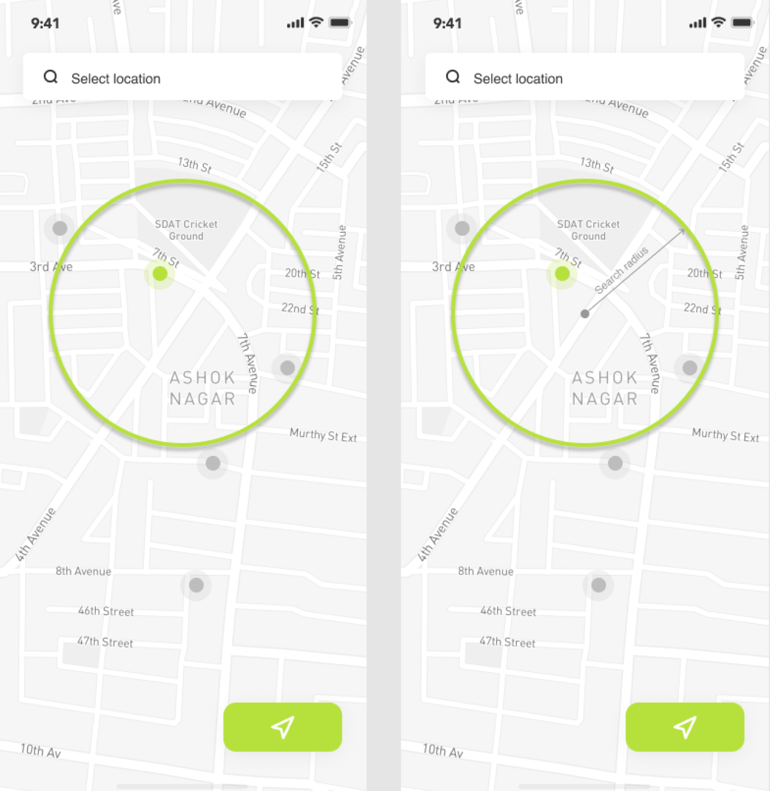

Searching for the objects on a map within an area looks to be a fairly straightforward task nowadays, 
but it could still be challenging especially when it comes to handing it within the context of your language and framework.
In our case, we are using[Django](https://www.djangoproject.com/) and [PostgreSQL](https://www.postgresql.org/) 
that have fantastic tools for using geographic types and do querying using [GeoDjango](https://docs.djangoproject.com/en/3.2/ref/contrib/gis/) and [PostGIS](https://postgis.net/).

## Feature description
Users should be able to search for the real estate objects (or other points of interest) within the given radius or the location.
The search radius has constrains from `100 meters` up to `30 kilometers` with the default value set to `10 kilometers`. Coordinates of the center could be stored in [Mercator projection](
https://en.wikipedia.org/wiki/Mercator_projection) to have seamless integration with Map/Tiles/GeoCoding providers.





## PostGIS functions and capabilities

With PostGIS there two commonly used scenarios that could be well suited for this. With the first approach, we could make 
sure that the distance between two geometries isn't bigger than a certain radius and then return objects matching the 
criteria. [`ST_DWithin`](https://postgis.net/docs/ST_DWithin.html) function could be used for which has the following synopsis.

```sql
boolean ST_DWithin(
    geography gg1, 
    geography gg2, 
    double precision distance_meters, 
    boolean use_spheroid = true);
```

`gg1` is the center of our search and the `gg2` will be the coordinate of the object 
we are matching.


The second solution is based on the calculation of the intersection of two geometries using [`ST_Intersects`](https://postgis.net/docs/ST_Intersects.html). 
Buffer could be built around our search location with the given radius and then we could get only the objects which are within the intersection with our buffered geometry. 

```sql
geography ST_Buffer(
    geography gg1, 
    float radius_of_buffer, 
    integer num_seg_quarter_circle);
```

```sql
boolean ST_Intersects( geography gg1 , geography gg2 );
```


`ST_Intersects` works fast and make use of indexes where `ST_Buffer` will buffer every geometry before intersecting which will be rather slower comparing to `ST_DWithin`. 
In our case, there were other places where buffered geometry was used therefore this way was selected.  Let's go into implementing it with Django.


## Basic Django implementation
The framework already supports plenty of the geographic database functions which could be found [here](https://docs.djangoproject.com/en/3.2/ref/contrib/gis/functions/#module-django.contrib.gis.db.models.functions) including for example 
`Distance`, `Centroid`, `Intersection`, and many others. But looks like that `ST_Buffer` support isn't there yet. 
We start with defining a simplified model to store our search criteria as requested by the feature. 

```python
# models.py
from django.contrib.gis.db import models
from django.contrib.gis.db.models import PointField
from django.core.validators import (
    MinValueValidator,
    MaxValueValidator,
)


class SearchCriteria(models.Model):
    geo_location = PointField(
        verbose_name='Location coordinates'
    )
    distance = models.PositiveIntegerField(
        verbose_name='Search radius (in meters)',
        default=20000,
        validators=[
            MinValueValidator(100),
            MaxValueValidator(30000),
        ],
    )

```

As was mentioned before our application will be using the buffer feature in other places, so it would be reasonable to create a manager 
for annotating queryset with the buffer value. Note as we are operating with metric units for the radius we would have to cast our geometries into 
geography types.

```python
# managers.py
from django.contrib.gis.db.models import (
    F, 
    PointField, 
    PolygonField,
)
from django.contrib.gis.db.models.functions import GeoFunc

class BufferFunc(GeoFunc):
    """Define custom database function based on PostGIS ST_Buffer function"""
    function = 'ST_Buffer'

class SearchCriteriaManager(Manager):

    def with_buffer(self) -> QuerySet:
        """
        The resulting queryset will be annotated with `buff` property representing
        polygon object.
        """
        return self.annotate(
            buff=ExpressionWrapper(
                BufferFunc(
                    # Cast value to geography type to ensure
                    # correct metrics distance.
                    # It is used to build a correct buffer,
                    # otherwise the value of the radius will be set in the
                    # units of the current projection system
                    Cast(
                        'geo_location', 
                        PointField(geography=True)
                    ), 
                    F('distance')
                ),
                output_field=PolygonField()
            )
        )
```

Add `SearchCriteriaManager`  as a default manager for the `SearchCriteria` model.
```python
# models.py
... 

from core.managers import SearchCriteriaManager


class SearchCriteria(models.Model):
    geo_location = PointField(
        verbose_name='Location coordinates'
    )
    distance = models.PositiveIntegerField(
        verbose_name='Search radius (in meters)',
        default=20000,
        validators=[
            MinValueValidator(100), 
            MaxValueValidator(30000),
        ],
    )
    objects = SearchCriteriaManager()
```

### Register the model in the admin
To quickly add new objects we will register our model in admin which gives us a nice interface for managing our objects.
`OSMGeoAdmin` class allows us to load OSM ([OpenStreetMap](https://www.openstreetmap.org/)) tiles and goes with other settings like default latitude and longitude, etc.

```python
# admin.py
from django.contrib import admin

from django.contrib.gis.admin import OSMGeoAdmin

from core.models import SearchCriteria


class SearchCriteriaAdmin(OSMGeoAdmin):
    list_display = (
        '__str__',
        'distance',
    )


admin.site.register(SearchCriteria, SearchCriteriaAdmin)
```


### Testing the solution

After adding few test objects we can make sure that `with_buffer` method extends our objects with an expected geometry.
`buff` property has a `Polygon` type that matches our expectations. To further prove it we can take the `GeoJSON` value of the geometry and visualize it using services like [GeoJSON.io](https://geojson.io/).
```python
>>> SearchCriteria.objects.with_buffer().last().buff
<Polygon object at 0x10ed795e8>

>>> SearchCriteria.objects.with_buffer().last().buff.geojson 
'{ "type": "Polygon", "coordinates": [ [ [ 8.835401282918115, 47.444211668394992 ], [ 8.827927172679484, 47.391537382069345 ],
[ 8.805492519705593, 47.340861557111154 ], [ 8.768996911528763, 47.294123357969781 ], [ 8.719867885154301, 47.253106475893162 ],
[ 8.660002412369668, 47.219372480662862 ], [ 8.591692772164897, 47.194203022350919 ], [ 8.517539800403968, 47.178552775612232 ],
[ 8.440356622258259, 47.173014615346119 ], [ 8.363066011300527, 47.177798095286839 ], [ 8.288594519470969, 47.192721877651124 ],
[ 8.219766512885965, 47.217220336529465 ], [ 8.159201245047289, 47.250364132384533 ], [ 8.109216102392239, 47.290894131167789 ], 
[ 8.071739153762552, 47.337267620966976 ], [ 8.048234098293234, 47.387715365251132 ], [ 8.03964059757484, 47.440307631225217 ], 
[ 8.046332753399465, 47.493026955403671 ], [ 8.068098107757621, 47.543845072370708 ], [ 8.10413896150482, 47.590801158312111 ], 
[ 8.153097015125601, 47.632078354099583 ], [ 8.213101339569546, 47.666075461067329 ], [ 8.281838531044214, 47.691470771504065 ], 
[ 8.356642669140996, 47.707275223512298 ], [ 8.434601489265372, 47.712872462428187 ], [ 8.512674119697316, 47.70804393881015 ], 
[ 8.587814939016164, 47.692977849195685 ], [ 8.657097675803973, 47.668261487787362 ], [ 8.717833853260867, 47.634857371217294 ],
[ 8.767680079196403, 47.594064266521123 ], [ 8.804729447682634, 47.547464939838463 ], [ 8.827583361042922, 47.496863006014706 ],
[ 8.835401282918115, 47.444211668394992 ] ] ] }'

```


To finish our testing we can create an additional model holding our points of interest which are real estate objects with their locations.

```python
# models.py
class POITypeChoices(models.TextChoices):
    HOUSE = 'house', 'House'
    APARTMENT = 'apartment', 'Apartment'


class POI(models.Model):
    geo_location = PointField(
        verbose_name='POI location'
    )
    poi_type = models.CharField(
        'POI type',
        max_length=100,
        choices=POITypeChoices.choices,
        default=POITypeChoices.APARTMENT
    )

    def __str__(self):
        return f'<POI {self.id}, {self.poi_type}>'
```

Querying of the `POI` objects for the given `SearchCriteria` could be done like following.

```python
>>> # check POI objects we have in DB
>>> POI.objects.all()
<QuerySet [<POI: <POI 1, apartment>>, <POI: <POI 2, apartment>>]>

>>> # get the buffer
>>> buffer = SearchCriteria.objects.with_buffer().last().buff

>>> # filter only POI objects within the intersection of the buffer and geometry
>>> POI.objects.filter(geo_location__intersects=buffer)
<QuerySet [<POI: <POI 1, apartment>>]>
```

Having annotated `buff` value comes handier when answering a question if there are any search criteria for the given `POI` 

```python
>>> poi = POI.objects.get(id=1)
>>> SearchCriteria.objects.with_buffer().filter(buff__intersects=poi.geo_location)
<QuerySet [<SearchCriteria: SearchCriteria object (2)>]>
```

## Footnotes

The described approach has obvious performance penalties and in the next article, we will go through measuring its speed and optimizing it using database indexes and `ST_DWithin` function. Bye:) 